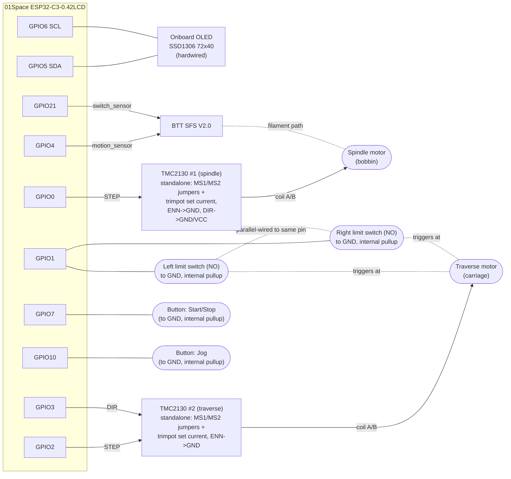
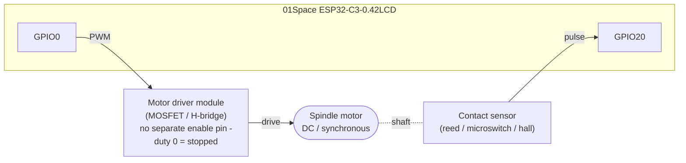

# Filament Winder

ESP32-C3 based coil winder built on the **01Space ESP32-C3-0.42LCD** board (onboard 72x40 OLED): 2x TMC2130 stepper drivers (spindle + traverse), BTT SFS V2.0 filament sensor, physical buttons, web UI for config.

## Hardware

- MCU: 01Space ESP32-C3-0.42LCD — [github.com/01Space/ESP32-C3-0.42LCD](https://github.com/01Space/ESP32-C3-0.42LCD). Onboard SSD1306 72x40 OLED hardwired to GPIO5/GPIO6, onboard blue LED on GPIO8, BOOT button on GPIO9. **Only 9 GPIOs are free: 0, 1, 2, 3, 4, 7, 10, 20, 21** — all 9 are used, no spares left (see pin map in `config.h`).
- Spindle motor (bobbin rotation) — NEMA + TMC2130
- Traverse motor (carriage on leadscrew) — NEMA + TMC2130
- 2x traverse limit switches (normally-open), one at each end of travel — no spool-width setting, the carriage just runs end to end
- BTT SFS V2.0 filament sensor (`motion_sensor` = movement encoder pulse, `switch_sensor` = mechanical presence switch)
- 2 buttons: Start/Stop (short press = start/stop/reset, long press = open/close on-device menu), Jog (hold-to-wind slow, or navigate the menu)

### Why TMC2130 runs in STANDALONE mode here

A "normal" TMC2130 setup (SPI config + hardware EN per driver) needs ~11 GPIOs for two drivers alone — more than this board has free in total. So both drivers run **standalone**: the MCU only drives STEP (and DIR for traverse only), no SPI, no `TMCStepper` library.

- **Microstepping**: set via the driver board's MS1/MS2 (or CFG) jumpers/resistors to match `MICROSTEPS` in `config.h` (default 16).
- **Motor current**: set via the driver board's onboard trimpot (no software current control).
- **Enable (ENN) pin**: tie to GND directly on the driver board (both drivers). There's no spare GPIO to drive it, so drivers are always hardware-enabled; "disable" in this firmware just means commanded speed = 0 (motors stay energized/holding).
- **Spindle DIR pin**: also tied directly on the driver board (to GND or VCC, direction doesn't matter) instead of to a GPIO. The spindle only ever turns one way — the traverse reversal is what makes the layer-to-layer pattern, not the spindle — so there's nothing for firmware to control there. `StepperSpindleDrive` drives the spindle's STEP pin directly with its own pulse timer instead of `AccelStepper`, precisely because it never needs a DIR signal. That freed-up GPIO (1) is spent on the traverse limit switches instead.

If you want SPI-based current control + StallGuard back, you'd need to add an I2C GPIO expander (e.g. PCF8574) on the shared OLED I2C bus (GPIO5/6, different address) for the extra CS/EN lines — not done here to keep the BOM/wiring simple.

Pin map lives in `include/config.h`.

## Wiring diagram

### Default: both motors as TMC2130 standalone steppers



### Optional: DC/synchronous motor spindle (`SPINDLE_DRIVE_MODE = SPINDLE_DRIVE_DC_MOTOR`)

Only the spindle branch changes — GPIO0 is repurposed, traverse/limit-switches/SFS/buttons wiring is identical to above. GPIO20 (unused in stepper mode) comes into play here.



## Spindle drive: stepper (default) vs optional DC/synchronous motor

The spindle (bobbin) can be driven by either backend, picked at compile time in `include/config.h`:

```c
#define SPINDLE_DRIVE_MODE   SPINDLE_DRIVE_STEPPER   // or SPINDLE_DRIVE_DC_MOTOR
```

- **`SPINDLE_DRIVE_STEPPER`** (default) — TMC2130 standalone, as above.
- **`SPINDLE_DRIVE_DC_MOTOR`** — a DC/synchronous motor driven via PWM (`DC_MOTOR_PWM_PIN` = GPIO0, no separate enable pin — the driver module just gets 0% duty when stopped), closed-loop speed-held with a PI controller using RPM measured from a shaft **contact sensor** (reed switch / microswitch / hall) wired to `SPINDLE_ENCODER_PIN` (GPIO20). Reuses the stepper's STEP pin slot (only one backend is ever compiled in, so no pin conflict) — no rewiring needed to switch, just change the define and re-flash.
- **Pulses per revolution** of the contact sensor is configurable, not hardcoded — set `SPINDLE_ENCODER_PULSES_PER_REV_DEFAULT` in `config.h`, or change it live via the web UI (`spindleEncoderPulsesPerRev` in `/api/config`; the field only appears in the UI when DC-motor mode is compiled in). 1 pulse/rev (single contact point) works but gives coarse traverse sync since the carriage only gets a position update once per spindle revolution; more contact points = smoother sync.
- Whichever backend is active, `MotionControl` treats it the same way (`ISpindleDrive` interface in `SpindleDrive.h`): it asks for rotation-delta pulses each loop and uses that to advance the traverse, so the layer-to-layer winding logic doesn't change between modes.
- PI gains for the DC-motor speed loop (`KP`/`KI`) are constants at the top of `DcSpindleDrive.h` — tune them to your motor/inertia if speed hunts or lags.

## How it works

- **No spool-width setting.** The traverse just runs toward whichever end it's currently heading to and reverses when it hits that end's limit switch — the coil width is simply whatever's physically between the two switches. Both switches are wired in parallel to one GPIO (`TRAVERSE_LIMIT_PIN`); firmware never needs to tell them apart because it always knows which direction it's currently driving the carriage, so a trigger can only be the switch at the end being approached. `TRAVERSE_LIMIT_DEBOUNCE_MS` ignores repeat triggers right after a flip, so the carriage has time to physically clear the switch before it can trigger again.
- **Homing**: at boot, before anything else can run, the traverse seeks `TRAVERSE_LIMIT_PIN` at slow speed (`TRAVERSE_HOMING_SPEED_MM_S`) and zeroes its position there — this is the `HOMING` state (target-icon on the OLED), non-blocking so the web UI is already up while it happens. After that first trigger it treats the carriage as heading forward (toward the other end) from then on.
- **Spindle** spins continuously at `SPINDLE_WIND_RPM` while winding.
- **Traverse** speed/pitch is derived in software from spindle rotation pulses (not run independently): each spindle revolution advances the carriage by exactly one filament diameter — that's what produces the layer-to-layer winding — while direction comes purely from the limit switches, not a computed bound.
- **Length** is measured via the SFS `motion_sensor` pin as an encoder: each toggle = `SFS_MM_PER_PULSE` mm of filament fed. **Calibrate this**: feed a known length through the sensor by hand, count pulses (or watch `lengthMm` in `/api/status`), divide.
- **Runout/jam detection**: two independent checks stop winding — the SFS `switch_sensor` pin (mechanical, filament physically out) OR no `motion_sensor` pulses for `SFS_RUNOUT_TIMEOUT_MS` while winding is active (catches a jam where filament is still present but not feeding). `SFS_SWITCH_PRESENT_LEVEL` in `config.h` sets which digital level means "filament present" — flip it if your unit reads inverted.
- **Jog button**: hold to spin spindle (+ synced traverse) at `SPINDLE_JOG_RPM`, release to return to previous state. Use for laying the first layer by hand-guiding the filament. Also triggerable remotely via `POST /api/jog/start` (repeated as a heartbeat while held, every `< JOG_REMOTE_TIMEOUT_MS`) / `POST /api/jog/stop` — see [`cardputer-remote/`](cardputer-remote/) for an M5Stack Cardputer app that uses this alongside the rest of the REST API.

## OLED screen and on-device menu

The 72x40 screen is too small for readable words at a glance, so the main run screen is icon-based: a 16x16 icon for state (circle=idle, target=homing, play triangle=winding, two bars=paused, up/down arrows=jog, checkmark=done, warning triangle=error/runout/jam), the fed length in large digits, a progress bar, and the currently configured target length underneath. No IP or percentage on this screen — see the menu for that. A small dot in the top-right corner lights up whenever any Wi-Fi station is joined to the AP (browser, [Cardputer remote](cardputer-remote/), etc) — shown/hidden on both the run screen and the menu.

**Long-press Start/Stop** (`BUTTON_LONG_PRESS_MS`, default 600 ms) opens/closes a 2-row menu (only from a resting state — stop winding first): IP address (view-only), target length. Inside the menu:
- **Jog** (short press) navigates — moves the cursor between rows, or cycles through preset values once a row is opened for editing.
- **Start/Stop** (short press) is "enter" then "confirm" — opens the selected row for editing (seeding the cursor at whichever preset is closest to the current value), and a second press applies the currently-shown preset and closes editing.
- Long-press Start/Stop again at any time to exit back to the run screen.

**Presets** (the target-length values the menu cycles through) are stored as JSON on LittleFS (`PRESETS_FILE`, default `/presets.json`) and loaded at boot, falling back to built-in defaults if the file is missing or malformed. Edit them either from the web UI ("Target length presets" field, comma-separated mm values, saved via `POST /api/presets`) or by hand-editing/uploading the JSON file directly.

## Build

```
pio run -e esp32-c3 -t uploadfs   # upload data/ (web UI) to LittleFS
pio run -e esp32-c3 -t upload     # flash firmware
pio device monitor
```

Device starts a Wi-Fi AP: SSID `FilamentWinder` / password `winder123` (edit in `config.h`). Connect and open `http://<device-ip>` (shown in the on-device menu) to set filament diameter, target length, and start/stop.

## Config to verify before first run

- `TRAVERSE_LEAD_MM_PER_REV` — actual leadscrew pitch of your traverse mechanism
- `SFS_MM_PER_PULSE` — SFS encoder calibration (see above)
- `MICROSTEPS` — must match the MS1/MS2 jumpers actually set on your TMC2130 driver boards
- `TRAVERSE_LIMIT_TRIGGERED_LEVEL` — flip if homing runs away instead of stopping at a switch
- Motor current — set on each driver's trimpot, not in software
# spool-winder
